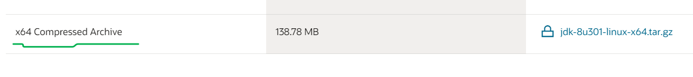
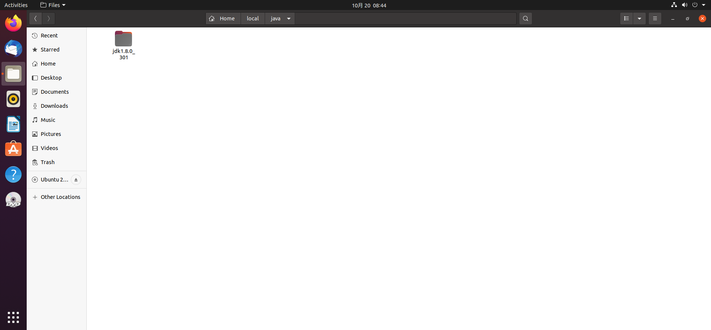
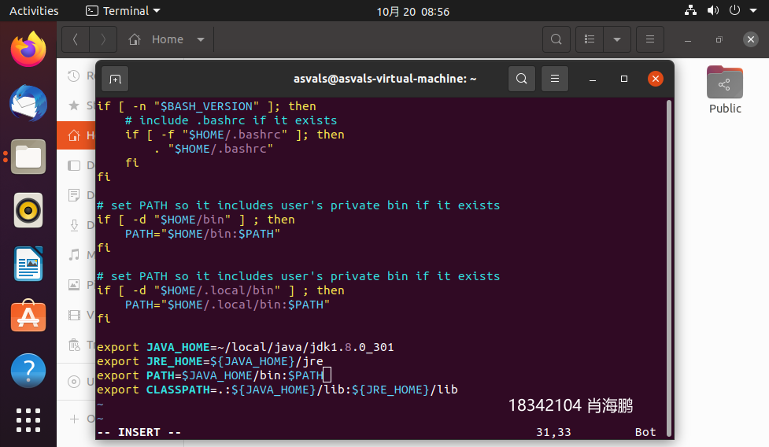
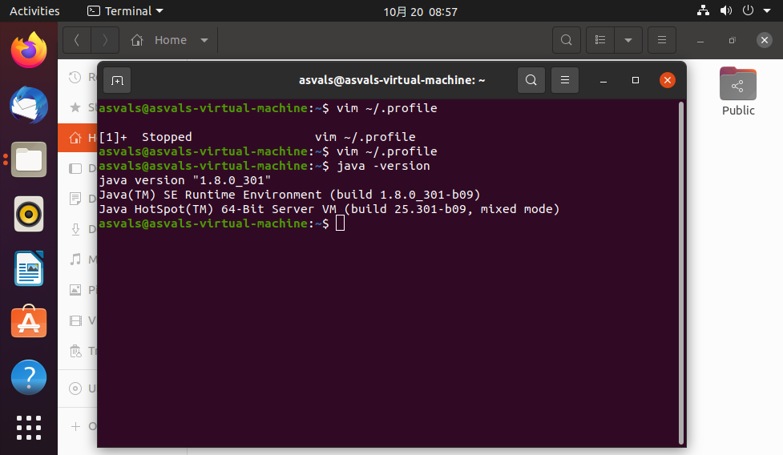
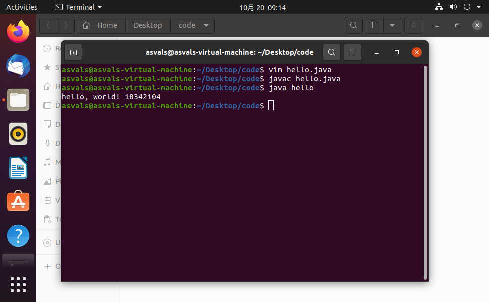
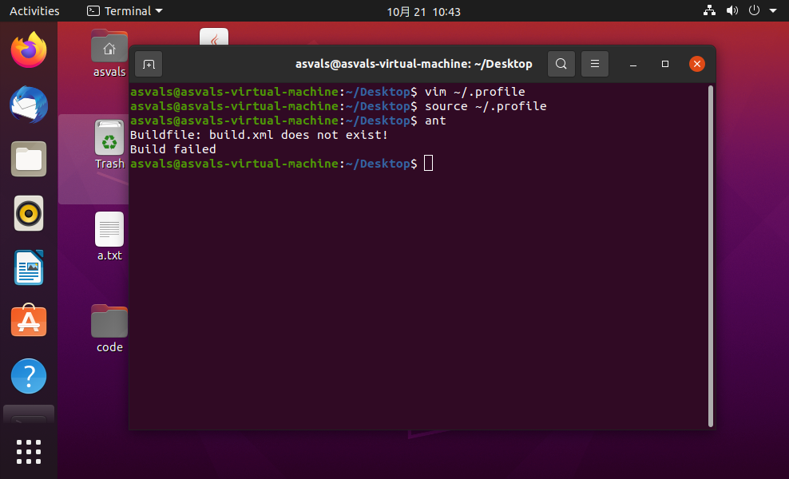

# STAGE1:Vi,Java,Ant,Junit的自学报告


<!-- TOC -->

- [Vi,Java,Ant,Junit的自学报告](#STAGE1:Vi,Java,Ant,Junit的自学报告vijavaantjunit的自学报告)
  - [Vi](#vi)
    - [Vi/Vim基本使用](#vivim的基本使用)
    - [Vi/Vim中模式的切换：](#vivim中模式的切换)
    - [Vim操作实例：](#Vim基本操作实例)
  - [Java](#java)
    - [Java的特性与优势](#java的特性与优势)
    - [Linux下Java8环境配置](#linux下java8环境配置)
    - [HelloWorld](#helloworld)
  - [Ant](#ant)
    - [简介](#简介)
    - [配置过程](#配置过程)
    - [Ant入门](#ant入门)
    - [Ant之project、target、property](#ant之projecttargetproperty)
    - [HelloWorld项目的ant编写](#helloworld项目的ant编写)
  - [Junit](#junit)
    - [简介](#简介-3)
    - [基础使用](#基础使用)
    - [原则](#原则)
    - [HelloWorld项目的Junit测试](#helloworld项目的junit测试)

<!-- /TOC -->

## Vi

### Vi/Vim的基本使用

vi/vim 共分为三种模式，分别是**命令模式（Command mode）**，**输入模式（Insert mode）**和**底线命令模式（Last line mode）**。 

1. 命令模式：
刚刚启动 vi/vim时，进入命令模式。此状态下敲击键盘动作会被Vim识别为命令，而非输入字符。此时按下i，并不会输入一个字符，i被当作了一个命令。以下是常用的几个命令：
   - i 切换到输入模式，以输入字符。
   - x 删除当前光标所在处的字符。
   - : 切换到底线命令模式，以在最底一行输入命令。


2. 输入模式:
在命令模式下按下i就进入了输入模式。在输入模式中，我们可以在键盘进行常规的输入。这是我们工作时主要使用的模式。

3. 底线命令模式:
在命令模式下按下:（英文冒号）就进入了底线命令模式。底线命令模式可以输入单个或多个字符的命令，可用的命令非常多。

> 按ESC键可随时退出底线命令模式。

### Vi/Vim中模式的切换：

vi/vim的三个模式：命令模式、输入模式、底线命令模式

- 进入命令模式：使用vi filename 或vim filename
- 命令模式进入输入模式：输入i、a、o。
- 输入模式返回命令模式：ESC键
- 命令模式进入底线命令模式：输入“：”
- 底线命令模式返回命令模式：ESC键
- 退出命令模式：输入“：”进入底线命令模式，输入wq回车，保存并离开。

### Vim基本操作实例：

1. 创建一个a.txt文件，然后使用vim编辑器进行编辑，输入i进入输入模式。


2. 输入hello, world及学号姓名


3. 输入完后，esc加：进入底层命令模式，然后输入wq保存退出。


4. 此时文件已经生成并成功保存，最后使用cat查看文件内容。


5. 成功输出
 


## Java
### Java的特性与优势

Java语言使用简单、是一个面向对象、分布式应用并且安全、体系结构中立并且可移植的高级语言，最重要，Java是一个动态语言。因其卓越的通用性、高效性、平台移植性和安全性等特性，Java自1995年问世以来，迅速成为全球范围内应用范围最广的开发语言。即使历经十余年发展，它仍然在行业内保持着“常青树”的地位。Java 语言是健壮的、安全的、高性能的。且具有可移植、体系结构中立、多线程等特性。

### Linux下Java8环境配置

我们没有使用云桌面，选择在本地环境配置。
1. 去官网下载Java 8



2. 把.gz文件放到目标文件夹

```shell
sudo tar zxvf ./jdk-8u301-linux-x64.tar.gz
```
解压



3. java环境变量的配置：
  - JAVA_HOME：指向jdk安装目录，该目录下有bin、lib目录。
  - PATH：系统原有的变量，指向命令搜索路径，在shell下执行命令时，它会到PATH变量制定的路径中查找相应的命令。
  - CLASSPATH：指向类搜索路径。通过该变量来寻找并使用类。

具体配置需要在bashrc文件中加入如下代码（根据实际进行修改：版本等信息），并更新配置（使用source命令）：



检查Java版本



安装成功。

### HelloWorld

使用命令行创建源代码

编写程序


编译 运行



可以知道安装和环境变量配置成功了


## Ant

### 简介

- Ant是Java的生成工具，是Apache的核心项目；
- Ant类似于Unix中的Make工具，都是用来编译、生成；
- Ant是跨平台的，而Make不能；
- Ant的主要目的就是把你想做的事情自动化，不用你手动一步一步做，因为里面内置了javac、java、创建目录、复制文件等功能，所以可以直接点击Ant文件，即可编译生成你的项目。


- 在Ant安装之前需要安装好JDK，并配置好JAVA_HOME；
- 新建环境变量ANT_HOME：值为ANT的主目录；
- 在path中配置%ANT_HOME%/bin；
- 配置完成之后，打开命令行，输入ant，当出现“Buildfile: build.xml does not exist! Build failed”时说明配置完成；

### 配置过程
先去下载ant1.7.0


解压到Linux里的路径下


进入profile文件配置一哈环境变量


用source命令更新一下
控制台输入ant，可以看到已经安装成功了

