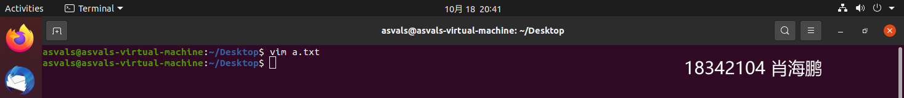
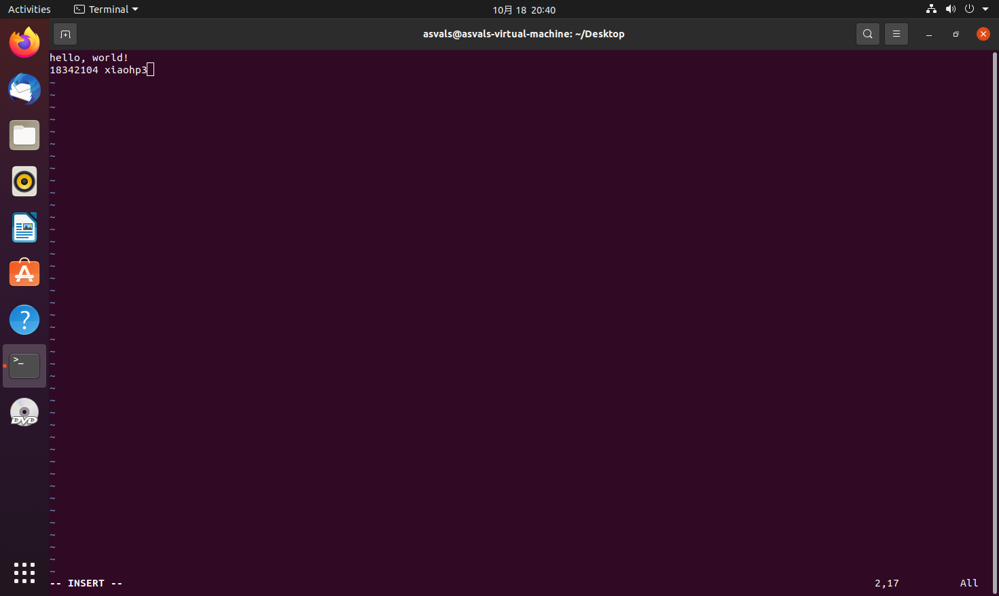
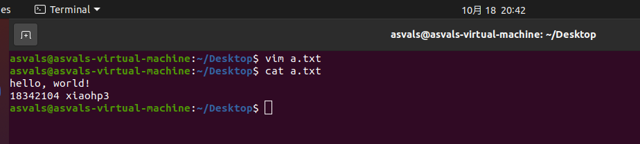
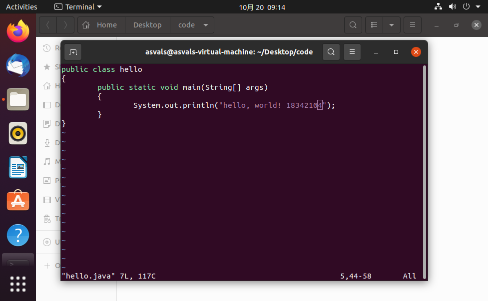
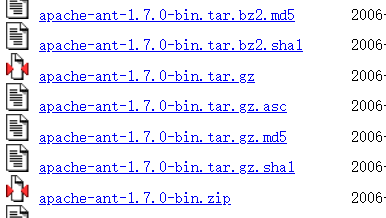
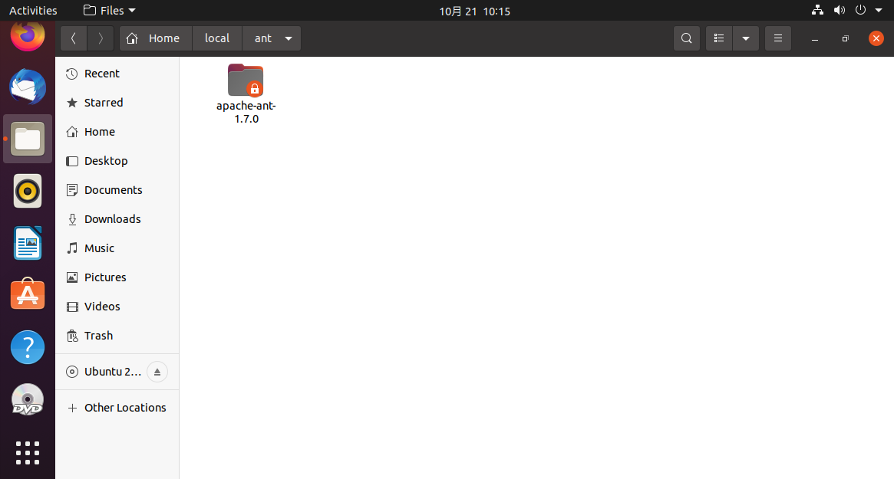
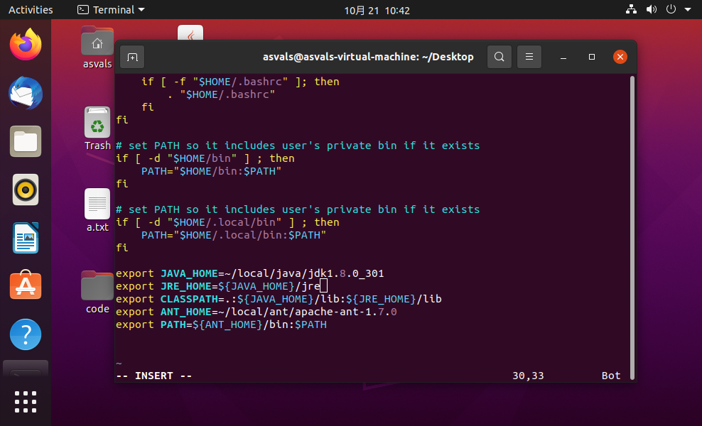

# STAGE1:Vi,Java,Ant,Junit的自学报告


<!-- TOC -->

- [Vi,Java,Ant,Junit的自学报告](#STAGE1:Vi,Java,Ant,Junit的自学报告vijavaantjunit的自学报告)
  - [Vi](#vi)
    - [Vi/Vim基本使用](#vivim的基本使用)
    - [Vi/Vim中模式的切换：](#vivim中模式的切换)
    - [Vim操作实例：](#Vim基本操作实例)
  - [Java](#java)
    - [Java的特性与优势](#java的特性与优势)
    - [Linux下Java8环境配置](#linux下java8环境配置)
    - [HelloWorld](#helloworld)
  - [Ant](#ant)
    - [简介](#简介)
    - [配置过程](#配置过程)
    - [Ant入门](#ant入门)
    - [Ant之project、target、property](#ant之projecttargetproperty)
    - [HelloWorld项目的ant编写](#helloworld项目的ant编写)
  - [Junit](#junit)
    - [简介](#简介-3)
    - [基础使用](#基础使用)
    - [原则](#原则)
    - [HelloWorld项目的Junit测试](#helloworld项目的junit测试)

<!-- /TOC -->

## Vi

### Vi/Vim的基本使用

vi/vim 共分为三种模式，分别是**命令模式（Command mode）**，**输入模式（Insert mode）**和**底线命令模式（Last line mode）**。 

1. 命令模式：
刚刚启动 vi/vim时，进入命令模式。此状态下敲击键盘动作会被Vim识别为命令，而非输入字符。此时按下i，并不会输入一个字符，i被当作了一个命令。以下是常用的几个命令：
   - i 切换到输入模式，以输入字符。
   - x 删除当前光标所在处的字符。
   - : 切换到底线命令模式，以在最底一行输入命令。


2. 输入模式:
在命令模式下按下i就进入了输入模式。在输入模式中，我们可以在键盘进行常规的输入。这是我们工作时主要使用的模式。

3. 底线命令模式:
在命令模式下按下:（英文冒号）就进入了底线命令模式。底线命令模式可以输入单个或多个字符的命令，可用的命令非常多。

> 按ESC键可随时退出底线命令模式。

### Vi/Vim中模式的切换：

vi/vim的三个模式：命令模式、输入模式、底线命令模式

- 进入命令模式：使用vi filename 或vim filename
- 命令模式进入输入模式：输入i、a、o。
- 输入模式返回命令模式：ESC键
- 命令模式进入底线命令模式：输入“：”
- 底线命令模式返回命令模式：ESC键
- 退出命令模式：输入“：”进入底线命令模式，输入wq回车，保存并离开。

### Vim基本操作实例：

1. 创建一个a.txt文件，然后使用vim编辑器进行编辑，输入i进入输入模式。



2. 输入hello, world及学号姓名



3. 输入完后，esc加：进入底层命令模式，然后输入wq保存退出。


4. 此时文件已经生成并成功保存，最后使用cat查看文件内容。



5. 成功输出
 


## Java
### Java的特性与优势

Java语言使用简单、是一个面向对象、分布式应用并且安全、体系结构中立并且可移植的高级语言，最重要，Java是一个动态语言。因其卓越的通用性、高效性、平台移植性和安全性等特性，Java自1995年问世以来，迅速成为全球范围内应用范围最广的开发语言。即使历经十余年发展，它仍然在行业内保持着“常青树”的地位。Java 语言是健壮的、安全的、高性能的。且具有可移植、体系结构中立、多线程等特性。

### Linux下Java8环境配置

我们没有使用云桌面，选择在本地环境配置。
1. 去官网下载Java 8


2. 把.gz文件放到目标文件夹

```shell
sudo tar zxvf ./jdk-8u301-linux-x64.tar.gz
```
解压


3. java环境变量的配置：
  - JAVA_HOME：指向jdk安装目录，该目录下有bin、lib目录。
  - PATH：系统原有的变量，指向命令搜索路径，在shell下执行命令时，它会到PATH变量制定的路径中查找相应的命令。
  - CLASSPATH：指向类搜索路径。通过该变量来寻找并使用类。

具体配置需要在bashrc文件中加入如下代码（根据实际进行修改：版本等信息），并更新配置（使用source命令）：


检查Java版本


安装成功。

### HelloWorld

使用命令行创建源代码

编写程序



编译 运行


可以知道安装和环境变量配置成功了


## Ant

### 简介

- Ant是Java的生成工具，是Apache的核心项目；
- Ant类似于Unix中的Make工具，都是用来编译、生成；
- Ant是跨平台的，而Make不能；
- Ant的主要目的就是把你想做的事情自动化，不用你手动一步一步做，因为里面内置了javac、java、创建目录、复制文件等功能，所以可以直接点击Ant文件，即可编译生成你的项目。


- 在Ant安装之前需要安装好JDK，并配置好JAVA_HOME；
- 新建环境变量ANT_HOME：值为ANT的主目录；
- 在path中配置%ANT_HOME%/bin；
- 配置完成之后，打开命令行，输入ant，当出现“Buildfile: build.xml does not exist! Build failed”时说明配置完成；

### 配置过程
先去下载ant1.7.0



解压到Linux里的路径下



进入profile文件配置一哈环境变量



用source命令更新一下
控制台输入ant，可以看到已经安装成功了


### ant的使用

ant的默认生成文件为build.xml；

输入ant后，ant会在当前目录下搜索是否有build.xml，如果有，则执行；

### HelloWorld项目的ant编写

```
<?xml version="1.0" ?> 
<project name ="HelloWorld" default="run" basedir="."> 
    <target name="clean"> 
        <delete dir="${basedir}/build"/> 
    </target> 
    <target name="compile"  depends ="clean"> 
        <mkdir dir ="${basedir}/build/classes"/> 
        <javac srcdir ="${basedir}/src" destdir ="${basedir}/build/classes"/> 
    </target> 
     <target name="run"  depends ="compile"> 
        <java classname ="HelloWorld"> 
            <classpath> 
               <pathelement path="${basedir}/build/classes"/> 
            </classpath> 
        </java> 
    </target> 
</project> 

```


## Java计算器

整体实现思路与原理：
1. 需要用到JAVA GUI的JFrame、JLabel、JTextField、JButton等组件
2. 界面的布局需要用到GridLayout布局。
3. 给button添加事件处理，使用addActionListener
4. 计算器的运行逻辑，输入两个数，选择运算规则（加减乘除），计算结果。

实现逻辑见代码：


## Junit

### 简介

JUnit是一个Java语言的单元测试框架。它由Kent Beck和Erich Gamma建立，逐渐成为源于Kent Beck的sUnit的xUnit家族中最为成功的一个。 JUnit有它自己的JUnit扩展生态圈。多数Java的开发环境都已经集成了JUnit作为单元测试的工具。 

JUnit是由 Erich Gamma 和 Kent Beck 编写的一个回归测试框架（regression testing framework）。Junit测试是程序员测试，即所谓白盒测试，因为程序员知道被测试的软件如何（How）完成功能和完成什么样（What）的功能。Junit是一套框架，继承TestCase类，就可以用Junit进行自动测试了。

### 基础使用

1. @Test: 测试方法
   1. (expected=XXException.class)如果程序的异常和XXException.class一样，则测试通过
   2. (timeout=100)如果程序的执行能在100毫秒之内完成，则测试通过
2. @Ignore: 被忽略的测试方法：加上之后，暂时不运行此段代码
3. @Before: 每一个测试方法之前运行
4. @After: 每一个测试方法之后运行
5. @BeforeClass: 方法必须必须要是静态方法（static 声明），所有测试开始之前运行，注意区分before，是所有测试方法
6. @AfterClass: 方法必须要是静态方法（static 声明），所有测试结束之后运行，注意区分 @After

### 原则

- 测试方法上必须使用@Test进行修饰
- 测试方法必须使用public void 进行修饰，不能带任何的参数
- 建一个源代码目录来存放我们的测试代码，即将测试代码和项目业务代码分开
- 测试类所在的包名应该和被测试类所在的包名保持一致
- 测试单元中的每个方法必须可以独立测试，测试方法间不能有任何的依赖
- 测试类使用Test作为类名的后缀（不是必须）
- 测试方法使用test作为方法名的前缀（不是必须）

